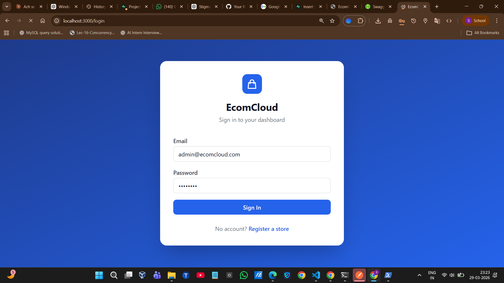
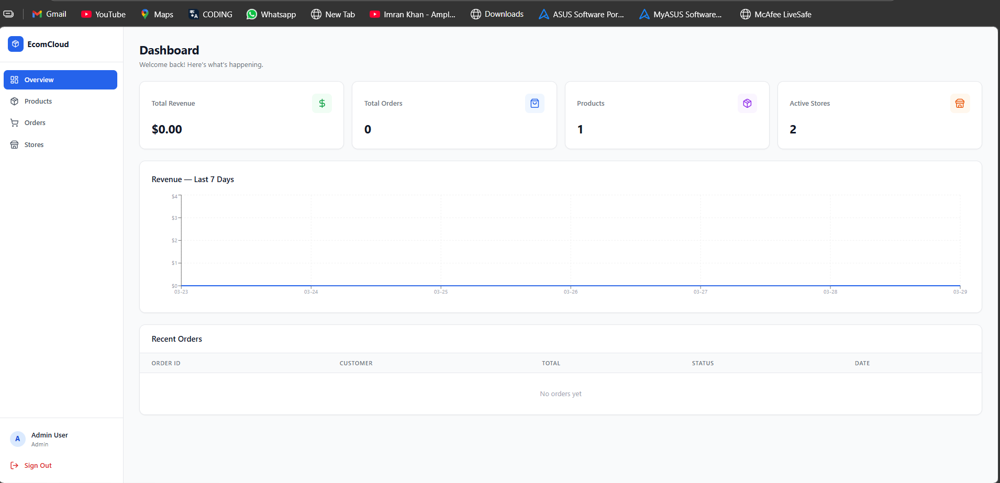

# EcomCloud — Multi-Tenant E-Commerce Platform

## Project Structure

```
ecomcloud/
├── backend/          # NestJS API
├── frontend/         # Next.js 14 Dashboard
├── supabase-schema.sql
├── docker-compose.yml
└── .github/workflows/ci.yml
```

## Quick Start

### 1. Supabase Setup
1. Create a project at https://supabase.com
2. Go to SQL Editor → New Query
3. Paste and run `supabase-schema.sql`
4. Copy your `SUPABASE_URL` and `SUPABASE_SERVICE_ROLE_KEY` from Project Settings → API

### 2. Backend
```bash
cd backend
cp .env.example .env
# Fill in your .env values
npm install
npm run start:dev
```
API runs on http://localhost:4000
Swagger docs at http://localhost:4000/api/docs

### 3. Frontend
```bash
cd frontend
cp .env.example .env
# Fill in your .env values
npm install
npm run dev
```
Dashboard runs on http://localhost:3000

### 4. Docker (optional)
```bash
cp backend/.env.example backend/.env
cp frontend/.env.example frontend/.env
# Fill in both .env files
docker-compose up --build
```

## Default Admin Login
- Email: admin@ecomcloud.com
- Password: admin123


## Scrrnshots

## 🔐 Login Page

<p align="center">
  
</p>

## 🏠 Home Page

<p align="center">
  
</p>

## 🛒 Store Page

<p align="center">
  
</p>


## Environment Variables

### backend/.env
| Variable | Description |
|---|---|
| SUPABASE_URL | Your Supabase project URL |
| SUPABASE_SERVICE_ROLE_KEY | Service role key (not anon key) |
| JWT_SECRET | Any long random string |
| STRIPE_SECRET_KEY | Stripe secret key (sk_test_...) |
| PORT | API port (default 4000) |
| FRONTEND_URL | Frontend URL for CORS |

### frontend/.env
| Variable | Description |
|---|---|
| NEXT_PUBLIC_API_URL | Backend URL (http://localhost:4000) |
| NEXT_PUBLIC_STRIPE_PUBLISHABLE_KEY | Stripe publishable key (pk_test_...) |

## API Endpoints

| Method | Endpoint | Description |
|---|---|---|
| POST | /auth/register | Register user / store |
| POST | /auth/login | Login, get JWT |
| GET | /dashboard/overview | Stats overview |
| GET | /dashboard/revenue-chart | 7-day revenue |
| GET | /dashboard/recent-orders | Last 10 orders |
| GET | /tenants | List tenants |
| GET | /tenants/:id/stats | Tenant stats |
| GET | /tenants/:id/products | List products |
| POST | /tenants/:id/products | Create product |
| PUT | /tenants/:id/products/:pid | Update product |
| DELETE | /tenants/:id/products/:pid | Delete product |
| GET | /tenants/:id/orders | List orders |
| POST | /tenants/:id/orders | Create order + Stripe intent |
| POST | /tenants/:id/orders/:oid/confirm | Confirm payment |
| PUT | /tenants/:id/orders/:oid/status | Update status |

## User Roles
- **admin** — sees all stores, all orders, all analytics
- **store_owner** — sees only their own store's data


